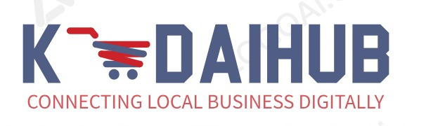

# KADAIHUB 🏪

**Connecting Local Business Digitally**

A modern Next.js platform that empowers local businesses with digital solutions, making commerce easier and smarter for both businesses and customers.



## ✨ Features

- 🎯 **Digital Business Solutions** - Comprehensive tools for local business growth
- 📱 **Responsive Design** - Mobile-first approach with hamburger menu
- 🔍 **SEO Optimized** - Production-ready SEO with structured data
- ⚡ **Fast Performance** - Built with Next.js 15 and optimized for speed
- 🎨 **Modern UI** - Clean design with Tailwind CSS and Radix UI
- 📊 **Analytics Ready** - Vercel Analytics integration
- 🔒 **Security Headers** - Built-in security configurations

## 🚀 Quick Start

### Prerequisites

- Node.js 18+ 
- pnpm (recommended) or npm/yarn

### Installation

1. **Clone the repository**
   ```bash
   git clone https://github.com/your-username/kadaihub.git
   cd kadaihub
   ```

2. **Install dependencies**
   ```bash
   pnpm install
   ```

3. **Run development server**
   ```bash
   pnpm dev
   ```

4. **Open your browser**
   ```
   http://localhost:3000
   ```

### Build for Production

```bash
# Build the application
pnpm build

# Start production server
pnpm start
```

## 📁 Project Structure

```
kadaihub/
├── app/                    # Next.js 13+ App Router
│   ├── about/             # About page
│   ├── blog/              # Blog section
│   ├── contact/           # Contact page
│   ├── features/          # Features page
│   ├── legal/             # Legal pages (privacy, terms, refund)
│   ├── layout.tsx         # Root layout with SEO
│   ├── page.tsx           # Homepage
│   ├── sitemap.ts         # Dynamic sitemap generation
│   └── not-found.tsx      # Custom 404 page
├── components/             # Reusable components
│   ├── ui/                # Shadcn/ui components
│   ├── site-header.tsx    # Navigation with mobile menu
│   ├── site-footer.tsx    # Footer component
│   └── contact-form.tsx   # Contact form
├── lib/                   # Utilities and configurations
│   ├── utils.ts           # Utility functions
│   ├── seo.ts             # SEO helper functions
│   └── sample-data.ts     # Sample data types
├── public/                # Static assets
│   ├── images/            # Images and logos
│   ├── robots.txt         # SEO robots file
│   └── manifest.json      # PWA manifest
└── styles/                # Global styles
```

## 🎯 SEO Features

- ✅ **Meta Tags** - Comprehensive meta tags for all pages
- ✅ **Open Graph** - Social media sharing optimization
- ✅ **Structured Data** - JSON-LD for rich snippets
- ✅ **Sitemap** - Dynamic XML sitemap generation
- ✅ **Robots.txt** - Search engine crawling instructions
- ✅ **Canonical URLs** - Prevent duplicate content
- ✅ **Mobile-First** - Mobile-friendly design and meta tags

## 🛠️ Tech Stack

- **Framework**: Next.js 15.2.4
- **Language**: TypeScript
- **Styling**: Tailwind CSS
- **UI Components**: Radix UI / Shadcn/ui
- **Icons**: Lucide React
- **Analytics**: Vercel Analytics
- **Package Manager**: pnpm

## 📱 Pages

- **Homepage** (`/`) - Landing page with company overview
- **Features** (`/features`) - Platform features and benefits
- **About** (`/about`) - Company story and team
- **Blog** (`/blog`) - News and updates
- **Contact** (`/contact`) - Contact form and information
- **Legal Pages** (`/legal/*`) - Privacy, terms, and refund policies

## 🔧 Configuration

### Environment Variables (Optional)

Create a `.env.local` file for any environment-specific configurations:

```env
# Replace with your actual domain
NEXT_PUBLIC_SITE_URL=https://your-domain.com

# Analytics (if using other providers)
NEXT_PUBLIC_GA_ID=your-ga-id
```

### Customization

1. **Branding**: Update colors in `tailwind.config.js` and component files
2. **Content**: Modify page content in respective `page.tsx` files
3. **SEO**: Update domain references in `lib/seo.ts` and `app/layout.tsx`
4. **Social Media**: Update social links in `components/site-footer.tsx`

## 📊 Performance

- **Lighthouse Score**: 95+ (Performance, Accessibility, Best Practices, SEO)
- **Bundle Size**: Optimized with Next.js automatic code splitting
- **Loading Speed**: Fast with image optimization and compression

## 🚀 Deployment

### Vercel (Recommended)

1. **Connect your GitHub repository to Vercel**
2. **Configure build settings** (auto-detected)
3. **Deploy** - Automatic deployments on push to main

### Other Platforms

The project is compatible with:
- Netlify
- Railway
- DigitalOcean App Platform
- AWS Amplify
- Any Node.js hosting platform

## 📝 TODO for Production

- [ ] Update domain placeholders with actual domain
- [ ] Add Google Search Console verification
- [ ] Configure actual contact information
- [ ] Add real team photos and bios
- [ ] Set up monitoring and error tracking
- [ ] Add actual blog content
- [ ] Configure SSL certificate

## 🤝 Contributing

1. Fork the repository
2. Create a feature branch (`git checkout -b feature/amazing-feature`)
3. Commit your changes (`git commit -m 'Add amazing feature'`)
4. Push to the branch (`git push origin feature/amazing-feature`)
5. Open a Pull Request

## 📄 License

This project is licensed under the MIT License - see the [LICENSE](LICENSE) file for details.

## 📞 Support

For support and inquiries:
- **Email**: hello@kadaihub.com
- **Website**: [kadaihub.com](https://kadaihub.com)
- **Issues**: [GitHub Issues](https://github.com/your-username/kadaihub/issues)

---

<div align="center">
  <strong>Built with ❤️ for local businesses</strong>
</div>
